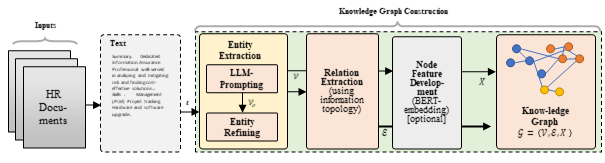
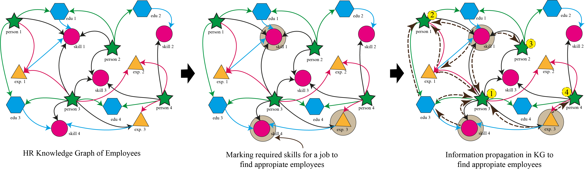

# **HRGraph: Leveraging LLMs for HR Data Knowledge Graphs with Information Propagation-based Job Recommendation**
- **Authors:** Azmine Toushik Wasi

---
**Abstract:** Knowledge Graphs (KGs) serving as semantic networks, prove highly effective in managing complex interconnected data in different domains, by offering a unified, contextualized, and structured representation with flexibility that allows for easy adaptation to evolving knowledge. Processing complex Human Resources (HR) data, KGs can help in different HR functions like recruitment, job matching, identifying learning gaps, and enhancing employee retention. Despite their potential, limited efforts have been made to implement practical HR knowledge graphs. This study addresses this gap by presenting a framework for effectively developing HR knowledge graphs from documents using Large Language Models. The resulting KG can be used for a variety of downstream tasks, including job matching, identifying employee skill gaps, and many more. In this work, we showcase instances where HR KGs prove instrumental in precise job matching, yielding advantages for both employers and employees. Empirical evidence from experiments with information propagation in KGs and Graph Neural Nets, along with case studies underscores the effectiveness of KGs in tasks such as job and employee recommendations and job area classification.

## Architecture
 Pipeline of *HRGraph*.

<p align="center">
  
</p>

Information propagation in Knowledge Graph
<p align="center">
  
</p>

---

## Citation
```
@inproceedings{
azmine2024hrgraph,
title={HRGraph: Leveraging LLMs for HR Data Knowledge Graphs with Information Propagation-based Job Recommendation},
author={Azmine Toushik Wasi},
booktitle={First Workshop on Knowledge Graphs and Large Language Models at The 62nd Annual Meeting of the Association for Computational Linguistics (ACL 2024)},
year={2024},
url={https://openreview.net/forum?id=Fvq90pEld2}
}
```
